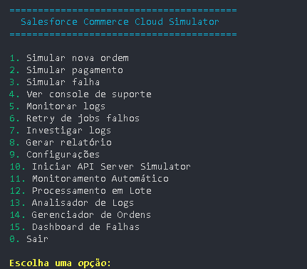

# Salesforce Commerce Cloud Support Simulator

Simulador completo de suporte para Salesforce Commerce Cloud, totalmente operado via linha de comando.


## 🚀 Funcionalidades

### Simulação de Backend Ecommerce
- ✅ Criação de ordens simuladas
- ✅ Processamento de pagamentos (com falhas aleatórias)
- ✅ Geração de falhas do sistema
- ✅ Logs detalhados em tempo real

### Console de Suporte
- ✅ Visualização de ordens falhas
- ✅ Sistema de retry automático
- ✅ Investigação de logs
- ✅ Aplicação de correções manuais
- ✅ Geração de relatórios

## 📦 Instalação

```bash
# 1. Clone ou copie os arquivos
git clone <repository>
cd scc-simulator

# 2. Dê permissões de execução
chmod +x *.sh

# 3. Execute a instalação
./install.sh

# 4. Inicie o simulador
./start.sh